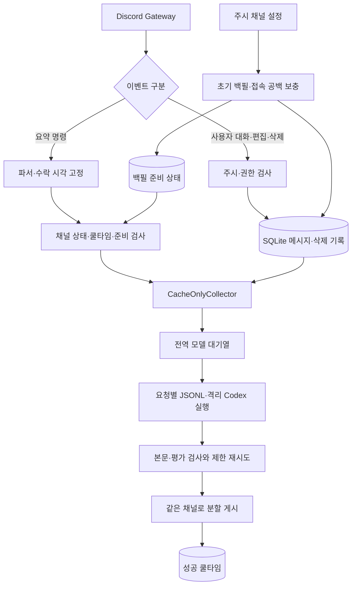

# 01. 프로젝트 이해와 총평

기준: `5f85734` · `1.1.3.1` / 출시 명칭 `v1.1.3a`. [검토 범위와 주의사항](README.md).

## 제품이 해결하는 문제

YoYackBot은 지정한 Discord 서버 텍스트 채널의 사용자 대화를 저장하고, `!!요약좀`으로 선택한 시간·개수 범위를 요약해 같은 채널에 게시한다. 한국어 캐릭터 말투, 실제 닉네임, 주제별 정리와 비평이 제품의 개성이다. 일반적인 업무 회의록 도구로 바꾸기보다 **재미있는 표현과 사실·화자 귀속의 정확성을 함께 지키는 것**이 개선 방향에 맞다.

현재 지원 범위는 다음과 같다.

| 영역 | 실제 구현 |
|---|---|
| 입력 | 기본 1시간, 분·시간·일·주·오늘·메시지 개수, 짧게·길게·자세히, 추가 요청 |
| 조회 | 도움, 사용량, 상태, 주시 채널 목록 |
| 관리 | `/채널 설정`, `/관리권한 설정`, 운영 CLI의 역할 조회·설정·해제 |
| 수집 | 첫 주시의 30일 백필, Gateway 신규·편집·삭제 반영, 연결 공백 보충 |
| 요약 | SQLite 캐시 선택 → JSONL → 격리된 Codex CLI → 출력 검사·제한 재시도 |
| 실행 제어 | 채널별 단일 작업, 전역 모델 기본 4개 동시 실행·8개 대기·600초 대기 제한 |
| 게시 | 요청 채널만 사용, 멘션·embed 억제, 메시지 분할, 성공 후 기본 60초 쿨타임 |
| 운영 | 단일 인스턴스 잠금, heartbeat, 준비 검사, 설정 전용 백업, systemd 운영 절차 |

기본 최대 개수 1,000은 **개수형 요청의 상한**이다. 시간형 요청은 그 기간 전체를 읽고 별도의 입력 바이트 제한을 적용한다. 두 제한을 같은 것으로 설명하면 운영자가 자원 사용량을 잘못 예상한다. DM·스레드·포럼·음성·이미지 이해·서버 간 통합 요약은 현행 핵심 경로의 대상이 아니다.

## 실제 데이터 흐름

핵심 근거는 `workflow.py:330–346`의 `build_workflow()`다. **현재 정상 요약 요청은 History를 즉시 조회하지 않고 `CacheOnlyCollector`를 사용한다.** History·coverage 기반 수집기가 별도로 남아 있어도, 그 테스트가 현행 실행 경로의 완전성을 자동으로 보장하지 않는다. B03·B04의 핵심 원인이 이 연결부에 있다.

## 검토한 구성과 역할

고정 트리는 추적 파일 533개다. `src` 45개 Python 파일, `tests` 65개 Python 파일·fixture 2개, `scripts` 12개, `docs` 32개, `Plans` 366개를 포함한다. 테스트 함수 정의는 425개이고 매개변수화를 포함한 실행 사례는 1,178개다. 파일 수나 통과 수를 안전성 점수로 사용하지 않았다.

| 구성요소 | 파일 | 책임·주요 검토 관점 |
|---|---|---|
| 시작·설정 | `__init__.py`, `__main__.py`, `config.py` | 버전·환경·CLI, 경로와 준비 검사의 정합성 |
| Discord 어댑터 | `discord.py` | 이벤트 분기, 백필 task 수명, 명령 응답, 권한 변화 |
| 명령·범위 | `parser.py`, `range_request.py`, `scope.py` | 문법, KST/UTC 경계, 요청 범위·안내 일관성 |
| 설정 UI | `channel_config.py`, `role_config.py`, `channel_list.py` | 소유자 제한, 권한 재확인, 공개 응답 수신자, DB 대기 |
| 관리 권한 | `manager_roles.py`, `watch_gate.py`, `watch_store.py` | 역할·주시 revision, 원자성, 삭제·재등록 |
| 캐시·백필 | `message_store.py`, `backfill.py`, `cache_collector.py` | 편집·삭제·보존기간·재접속·대규모 조회 |
| History·coverage | `history.py`, `coverage.py`, `collection.py`, `range_collection.py`, `count_collection.py`, `long_range.py` | 페이지 경계, 누락 복구, 현행 경로와의 연결 여부 |
| 작업 조정 | `workflow.py`, `state.py`, `cooldown.py`, `job_queue.py` | 취소·중복·공정성·성공 게시와 영속화의 경계 |
| 모델 실행 | `codex.py`, `codex_runner.py`, `codex_engine.py`, `input_files.py` | 계약, namespace·권한 격리, 프로세스 종료, 파일 수명 |
| 생성 품질 | `summary_prompt.py`, `output_quality.py`, `speaker_names.py` | 추가 요청 경계, 화자 표기, 평가·혐오·사실 검증 한계 |
| 결과 게시 | `summary_format.py`, `publisher.py` | 분할, 멘션, 권한 재확인, 부분 실패 |
| 운영·상태 | `usage.py`, `status_report.py`, `health.py`, `readiness.py`, `ops.py`, `settings_backup.py` | 진단 신뢰도, 비용, 상태 구분, 백업 복원 |
| 공통·호환 | `domain.py`, `errors.py`, `cache.py`, `output.py` | 데이터 계약·오류 분류·호환 모듈 |
| 개발·배포 도구 | `scripts`, `.github/workflows/ci.yml`, `deploy`, 패키지·잠금 파일 | 합성 평가/부하 도구, 검사 범위, 실행 환경 재현성 |
| 사양·증거 | README, DEVELOPMENT, CHANGELOG, `docs`, `Plans` | 원래 요구와 변경 이력, 현재 실행 경로, 완료와 미검증의 구분 |

코드·테스트·구성·운영 문서를 대상으로 정적 검토와 합성 검증을 했다. 계획 전체는 구조·버전·상태·연결을 확인하고, 결함과 관련된 계약·증거를 대조했다. `.private`, 실제 runtime 데이터, Git의 인증 관련 설정은 본문을 검토하거나 보고서로 복사하지 않았다.

## 잘된 설계

1. **실패 경계가 구체적이다.** 수집·모델·입력·대기열·게시 오류를 구분하고, 성공한 최종 게시에만 쿨타임을 적용한다. 불명확한 부분 전송을 무조건 재시도하지 않는다.
2. **데이터 경계를 코드에 반영했다.** Guild/channel 키, 주시 revision, 백필 generation token, tombstone이 있어 다른 서버·해제된 채널의 데이터가 뒤섞이지 않도록 한다.
3. **모델 격리가 프롬프트에만 의존하지 않는다.** 요청별 파일, 최소 환경, bwrap·CLI 권한 설정, 프로세스 그룹 종료, 인증 갱신 CAS가 함께 존재한다.
4. **변경 의도와 검증 이력이 풍부하다.** 테스트와 단계별 기록 덕분에 옛 계약과 현행 구현의 차이를 추적할 수 있다. 장시간 시험 생략도 PASS로 숨기지 않았다.
5. **대화와 요약을 로그에 남기지 않으려는 설계가 일관된다.** 분류·숫자 위주의 metrics와 설정 전용 백업이 개인정보 노출 면적을 줄인다.

## 핵심 비평

**개별 함수의 방어보다 함수 사이의 연결이 약하다.** 요청자에게 허용된 정보를 공개 응답에 실어도 되는지, 과거 수집기의 재검증 기능이 새 cache-only 경로에서도 실행되는지, 재시도 정보를 저장하는 작업마저 실패하면 worker가 살아 있는지 같은 문제가 남아 있다.

**기능의 중심은 요약인데 최근 변경과 테스트는 표현 규칙에 많이 집중돼 있다.** 마크다운·이모지·비평 말투는 제품에 중요하지만, 삭제 반영·누락 없는 범위·화자 귀속이 우선 성립해야 그 표현도 신뢰할 수 있다. B10~B12는 표현 규칙을 추가할 때 생성·분리·재생성·최종 게시 단계의 공통 계약이 함께 진화하지 못한 사례다.

**단일 프로세스·SQLite는 현재 규모에 합리적이다.** 바로 분산 큐나 외부 DB로 교체할 근거는 부족하다. 먼저 원자적 쓰기, 이벤트 루프 분리, 한도 적용 시점, worker 생존 감지와 실제 부하 측정으로 해결할 수 있는 부분을 다루는 편이 낫다.
